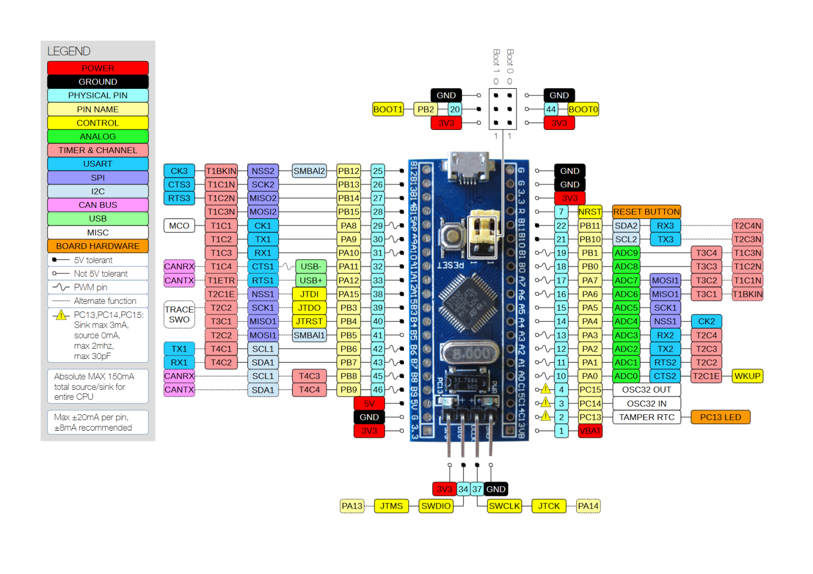

# APA102 Градиентная подсветка на STM32

Проект по разработке переливающихся градиентов для оформления рабочего стола, выполненный на адресной светодиодной ленте APA102, в среде **CubeIDE** с библиотекой **HAL**.
 
## Используется:
- APA102 – Адресная светодиодная лента на край стола у стены
- STM32 Blue Pill (STM32F103C8T6)
- Круглый модуль Энкодера для Arduino
- Сенсорные кнопки на TTP 223
- RGBW – Светодиодная лента для подсветки пола под столом

## Используемые библиотеки
- В коде используется библиотека для управления APA102 взятая у [HansAchterbahn](https://github.com/HansAchterbahn/APA102-on-STM32-with-HAL) (Июль 2019).
- Шум перлина взят с этого гиста https://gist.github.com/nowl/828013

## STM32 Пины:
